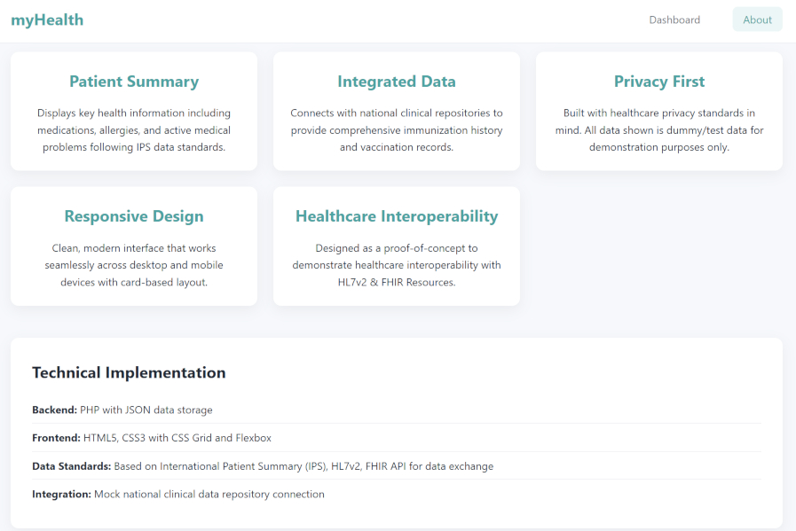
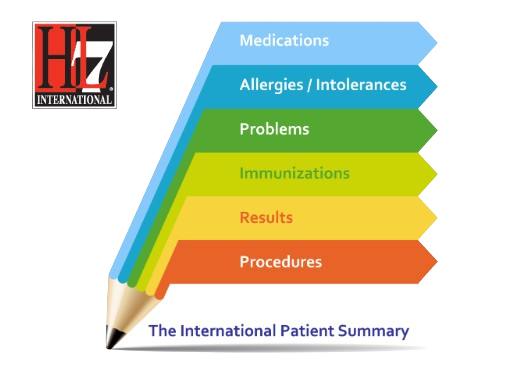

## 📱 myHealth Summary 

A responsive web application that consolidates personal health data, aligned with the International Patient Summary (IPS) standard.

## myHealth Summary - Dashboard
 

## myHealth Summary - About

## Swift Agent — Cryptogram

## The International Patient Summary (IPS)

## myHealth Summary - Overview

**Problem**: Health data is fragmented across multiple systems—primary care EMRs, ambulatory CIS platforms, and regional CDRs—resulting in siloed data. This fragmentation often prevents patients and providers from accessing a single, comprehensive, and reliable view of the patient summary.

**Solution**: myHealth Summary Proof of Concept (PoC) demonstrates that health data can be standardized, consolidated, and presented through a unified dashboard. Built on a lightweight, fast technology stack, the PoC provides a clear view of patient information, enabling better support for health-related decisions, more timely interventions, and improved collaboration across patient–provider ecosystems.
- **Feasibility** of IPS-aligned data display 
- **Simplification** of complex medical records for end users
- **Standards compliance** with HL7 FHIR/IPS concepts for global interoperability
- **On-demand access** enables patients to securely retrieve a consolidated view of their health summary at any time
- **Proactive engagement** helps patients manage their health with clear, actionable data and insights

## Implementation

**Tech Stack**: PHP, HTML/CSS, JSON, JSON-Schema, HL7 FHIR/IPS concepts

**Architecture**: Lightweight web app that reads IPS-formatted JSON data and displays a summary view

**Data**: Uses demo data with sample IPS record parsing 

## Standards Compliance

- **IPS/FHIR alignment** for global interoperability
- **Privacy-focused** with anonymized demo data
- **Standardized format** enables cross-system compatibility

## Results & Learnings

:white_check_mark: Successfully loads and displays sample patient summary  
:white_check_mark: Validates IPS standard implementation approach  
:memo: Key insight: Fragmented patient data consolidated in one standardized view 
:memo: Key insight: Complex medical information becomes easier to understand 
:memo: Key insight: On-demand access to the patient summary 

## Scope & Limitations

This is a **proof-of-concept** demonstrating core functionality:
- Not production-ready
- No authentication or user management
- Demo data only

## Quick Start
1. Clone the repo and run it locally using PHP's built-in server.
2. Alternatively, you can import the repo into Replit and run it there using a PHP Web Server instance.

<!-- ## 📈 myHealth Summary - Demo -->
<!-- This is a comment in markdown -->

## myHealth Summary - Demo

🌐 **[View Live Demo](http://myhealth-summary-demo.atwebpages.com/)**

---
© 2025 jspro1. All rights reserved.
