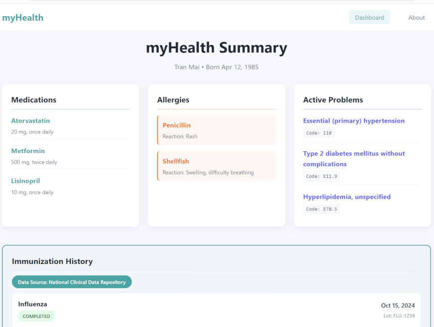
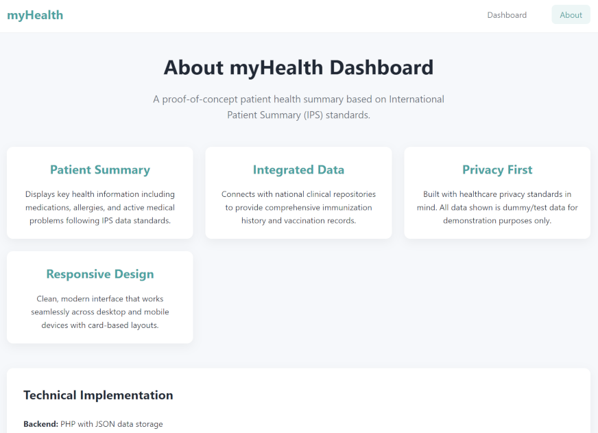

# myHealth Summary Dashboard 

A responsive web app health dashboard that consolidates personal health data aligned to the International Patient Summary (IPS) standard.

<H2>mHealth Summary Page</H2>
 

<H2>About myHealth Dashboard</H2>

